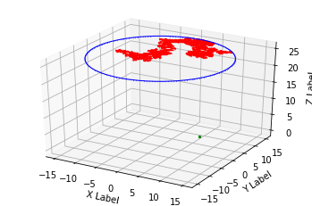
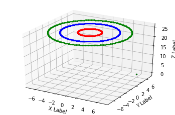
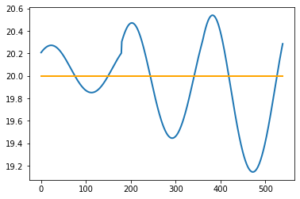
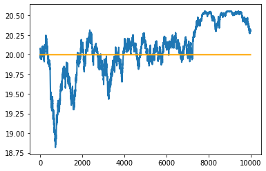
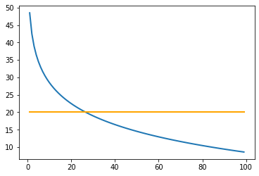

```python
import os 
import numpy as np
from mpl_toolkits.mplot3d import Axes3D  
import matplotlib.pyplot as plt
import json 
from math import sqrt
import math
import random
#Ипортируем необходимые данных для работы симуляции 
```


Запускаем класс симулирования БПЛА с установленной высотой и позицией пользователя 

```python
simulator = Simulation(speed=20, density=2.0, time=40, z_index=25, user=(6,6,0))
```

Получаем данные по Рандомному Блужданию БПЛА (Random Walking)

```python
goals_rw_chunk = simulator.RandomWalking()
```





```python
goals_chunk = simulator.CreateTrace()
simulator.ShowPath(goals_chunk)
distance_chunk = simulator.GetDistance(goals_chunk)
```





Собираем базовую станцию с установленными параметрами 

```python
    
base_station = BaseStation(transmit_power=24, transmission_bandwidth=(0.56*(10**9)), carrier_frequency=(60*(10**9)), receive_antenna_gain=3, transmit_antenna_gain=3)


```
Собираем данные для создания SIR (подробнее в самом файле)


```python
SIR_chunk = SIRDatabase(distance_chunk)
# print("BPLA SIR 1: ", SIR_chunk[0][0], "\tDistance: ", distance_chunk[0][0])
# print("BPLA SIR 2: ", SIR_chunk[1][0], "\tDistance: ", distance_chunk[1][0])
# print("BPLA SIR 3: ", SIR_chunk[2][0], "\tDistance: ", distance_chunk[2][0])
DrawSIR_all(SIR_chunk)
# DrawSIR_sep(SIR_chunk)
```





```python
distance_rw_chunk = simulator.GetDistance(goals_rw_chunk)
SIR_rw_chunk = SIRDatabase(distance_rw_chunk)
DrawSIR_all(SIR_rw_chunk)
```




Функция калибровки SIR чтобы понять правильно ли подобрали исходные данные. Это идеальные условия.

```python
def SIT_Test():
    sir_distance_array = [[],[]]
    sir_test = []
    for d in range(1, 100):
        SIR = base_station.CalculateSBR(float(d))
        sir_distance_array[0].append(SIR)
        sir_distance_array[1].append(d)
        sir_test.append(20)
        
    plt.plot(sir_distance_array[1], sir_distance_array[0], label='line 1', linewidth=2)
    plt.plot(sir_distance_array[1], sir_test, label='line 1', linewidth=2, c='orange')
    
```


```python
SIT_Test()
```





